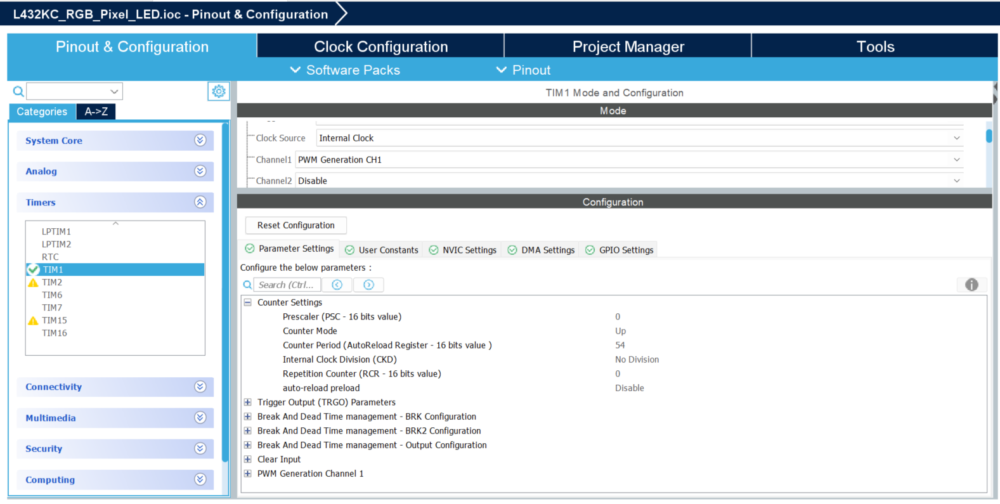
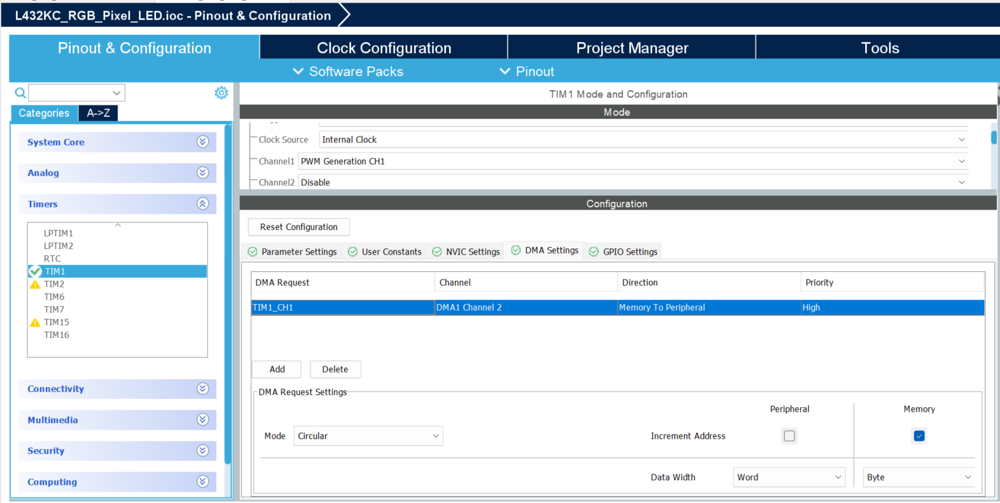
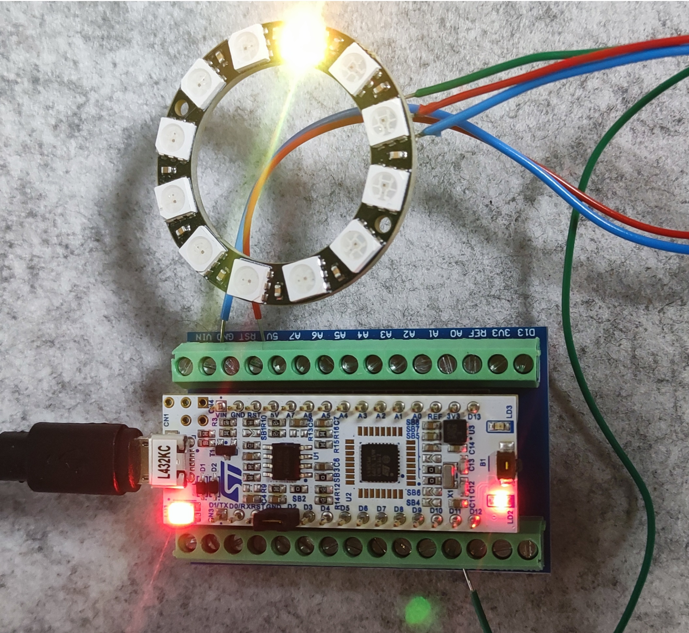
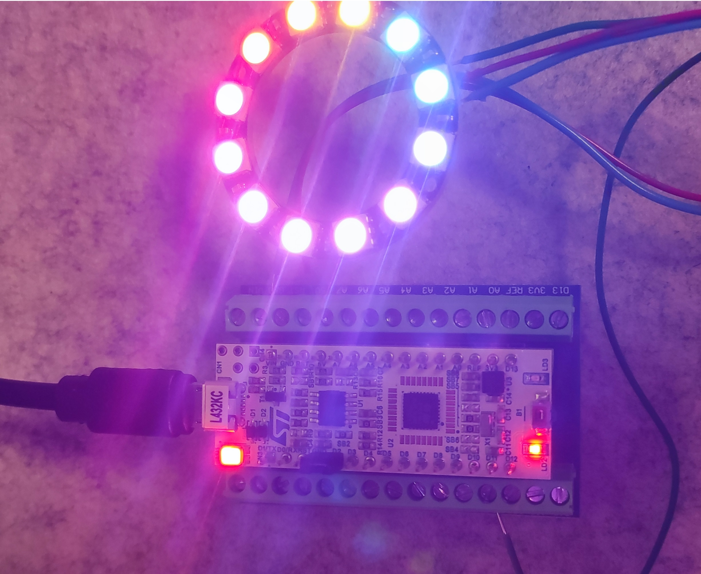

# **Documentation GitHub pour la bibliothèque Pixel_LED_Driver**

## 📚 **Description**
La **Pixel_LED_Driver** est une bibliothèque logicielle optimisée pour piloter des bandes de LEDs **WS2812B** et **SK6812** à l'aide d'un **STM32**. Cette bibliothèque utilise la **PWM avec DMA** pour envoyer des signaux haute vitesse aux LEDs, ce qui minimise la charge du processeur.  

Avec cette bibliothèque, vous pouvez :  
- Allumer et éteindre des LEDs individuellement.  
- Appliquer des couleurs personnalisées à chaque LED.  
- Appliquer des couleurs globales à toutes les LEDs.  
- Réaliser des effets visuels comme l'**effet arc-en-ciel (rainbow effect)**.  

---

## ✨ **Fonctionnalités**
- **Prise en charge des LEDs WS2812B et SK6812** (via configuration `NUM_BPP`).  
- **Contrôle des couleurs RGB et RGBW** (pour SK6812).  
- **Effet arc-en-ciel paramétrable** (durée et nombre de pixels).  
- **Conversion HSL vers RGB** pour des animations fluides.  
- **Utilisation efficace des ressources** grâce au **DMA et PWM**.  

---

## 📦 **Structure des fichiers**
```
📂 /Pixel_LED_Driver
   ├── 📄 Pixel_LED_Driver.h      // Fichier d'en-tête contenant les macros et prototypes
   └── 📄 Pixel_LED_Driver.c      // Fichier source avec l'implémentation des fonctions
```

---

## ⚙️ **Configuration de la bibliothèque (Pixel_LED_Driver.h)**
La configuration s'effectue principalement dans le fichier **`Pixel_LED_Driver.h`**. Vous y trouverez plusieurs paramètres importants.

### **1️⃣ Type de LED**
Choisissez le type de LED utilisé (WS2812B ou SK6812) :  
```c
#define LED_TYPE           LED_TYPE_WS2812B  // Ou LED_TYPE_SK6812
```
- **LED_TYPE_WS2812B** — 3 canaux de couleurs (R, G, B).  
- **LED_TYPE_SK6812** — 4 canaux de couleurs (R, G, B, W).  

---

### **2️⃣ Nombre de LEDs**
Configurez le nombre total de LEDs dans la bande.  
```c
#define NUM_PIXELS         (12) // Nombre total de LEDs
```
Changez la valeur de **`NUM_PIXELS`** selon le nombre de LEDs dans votre bande LED.

---

### **3️⃣ Paramètres des signaux PWM**
Le contrôle des LEDs nécessite des signaux spécifiques (PWM) pour les bits logiques **0** et **1**.  
```c
#define PWM_HI             (38)  // Durée du signal "1" logique
#define PWM_LO             (19)  // Durée du signal "0" logique
```
Ces valeurs dépendent de la fréquence de la **PWM** et de la bande de LED utilisée.  

---

### **4️⃣ Paramètres de la transmission DMA**
- **HTIM** : Nom du **Timer** utilisé.  
- **DMA_CHANNEL** : Nom du **DMA** associé au canal PWM.  
- **TIM_CHANNEL** : Canal utilisé sur le Timer (exemple : TIM_CHANNEL_1).  
Ces paramètres permettent d'adapter la bibliothèque à n'importe quel timer et canal DMA de votre STM32.  
```c
#define HTIM                htim1
#define DMA_CHANNEL         hdma_tim1_ch1
#define TIM_CHANNEL         TIM_CHANNEL_1
```
Si vous souhaitez passer au **Timer 2**, remplacez simplement `htim1` par `htim2` et **aucun autre changement dans la bibliothèque ne sera nécessaire**.
(pensez aussi à ajuster le cannal DMA et le cannal PWM !)

---

## ⚙️ **Configuration du Timer et du DMA**
Pour que la bibliothèque fonctionne, il est nécessaire de configurer correctement le Timer et le DMA comme illustré :  

<p align="center">
  
</p>

<p align="center">
  
</p>

---

## 🚀 **Utilisation des fonctions**
### **1️⃣ led_set_RGB**
> Définit la couleur d'une LED via ses composantes **Rouge, Vert, Bleu** (RVB).  
```c
led_set_RGB(0, 255, 0, 0); // Allume la première LED en rouge
```

### **2️⃣ led_set_all_RGB**
> Applique la même couleur **RVB** à toutes les LEDs.  
```c
led_set_all_RGB(0, 255, 0); // Toutes les LEDs sont vertes
```

### **3️⃣ led_render**
> Met à jour toutes les LEDs avec les couleurs actuelles.  
```c
led_render();
```

### **4️⃣ rainbow_effect**
> Affiche un **effet arc-en-ciel** dynamique sur la bande de LEDs.  
```c
rainbow_effect(10, 12, 15); // Effet arc-en-ciel pendant 10s sur 12 LEDs
```

---

## 🎨 **Effet Arc-en-Ciel (Rainbow)**
L'effet **rainbow_effect()** permet d'afficher un dégradé de couleurs sur les LEDs.  
### Paramètres :
| **Paramètre**       | **Description**              |
|---------------------|-----------------------------|
| `duration_seconds`  | Durée totale de l'effet en secondes |
| `num_pixels`        | Nombre de LEDs sur la bande  |
| `number_color_per_led` | Décalage des couleurs sur chaque LED |

**Exemple** :  
```c
rainbow_effect(10, 12, 10); // 10 secondes d'effet rainbow sur 12 LEDs avec 10 couleurs 
```

---

## 🔧 **Exemple d'utilisation complet**
```c
#include "Pixel_LED_Driver.h"

int main(void) {
    HAL_Init();
    SystemClock_Config();
    MX_TIM1_Init();
    HAL_TIM_PWM_Start(&htim1, TIM_CHANNEL_1);

    // Initialisation des LEDs
    led_set_all_RGB(0, 0, 0); // Éteint toutes les LEDs
    led_render();

    // Affiche l'effet arc-en-ciel
    rainbow_effect(10, 12, 15);

    while (1) {
        // Boucle principale
    }
}
```

---

## ⚠️ **Dépannage**
| **Problème**         | **Cause possible**            | **Solution**                   |
|---------------------|---------------------------------|----------------------------------|
| Les LEDs ne s'allument pas | Mauvaise configuration du timer | Vérifiez le prescaler, period et PWM |
| Les couleurs ne sont pas correctes | Mauvaise configuration des bits PWM | Vérifiez **PWM_HI** et **PWM_LO** |
| La première LED ne réagit pas | Buffer mal aligné | Augmentez la longueur du buffer de **+1** |
| L'effet arc-en-ciel ne défile pas | Mauvais calcul de HSL | Vérifiez le décalage de la teinte |

---

## **Rendu**

<p align="center">
  
</p>

<p align="center">
  
</p>
